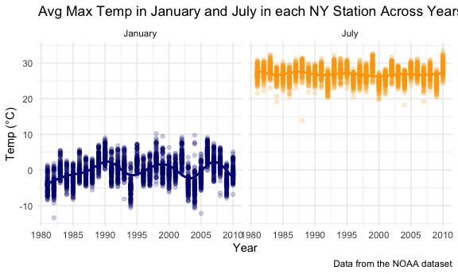
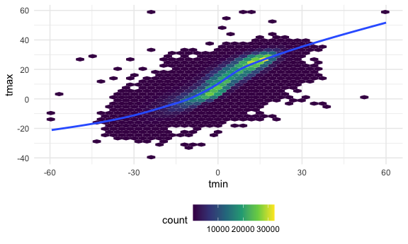
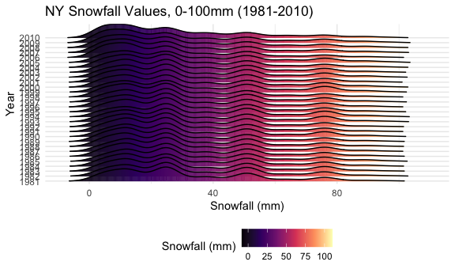

p8105_hw3_nr2774
================
Nergui
2022-10-09

### Problem 1

``` r
#devtools::install_github("p8105/p8105.datasets")
library(tidyverse)
```

    ## ── Attaching packages ─────────────────────────────────────── tidyverse 1.3.2 ──
    ## ✔ ggplot2 3.3.6      ✔ purrr   0.3.4 
    ## ✔ tibble  3.1.8      ✔ dplyr   1.0.10
    ## ✔ tidyr   1.2.1      ✔ stringr 1.4.1 
    ## ✔ readr   2.1.2      ✔ forcats 0.5.2 
    ## ── Conflicts ────────────────────────────────────────── tidyverse_conflicts() ──
    ## ✖ dplyr::filter() masks stats::filter()
    ## ✖ dplyr::lag()    masks stats::lag()

``` r
library(dplyr)
library(readxl)
library(ggplot2)
library(patchwork)
library(p8105.datasets)
library(lubridate)
```

    ## 
    ## Attaching package: 'lubridate'
    ## 
    ## The following objects are masked from 'package:base':
    ## 
    ##     date, intersect, setdiff, union

``` r
data("instacart")

knitr::opts_chunk$set(
  fig.width = 6,
  fig.asp = .6,
  out.width = "90%"
)

theme_set(theme_minimal() + theme(legend.position = "bottom"))

options(
  ggplot2.continuous.colour = "viridis",
  ggplot2.continuous.fill = "viridis"
)

scale_colour_discrete = scale_colour_viridis_d
scale_fill_discrete = scale_fill_viridis_d
```

``` r
data("instacart")

instacart = 
  instacart %>% 
  as_tibble(instacart)
```

#### Answer questions about the data

This dataset contains 1384617 rows and 15 columns, with each row
resprenting a single product from an instacart order. Variables include
identifiers for user, order, and product; the order in which each
product was added to the cart. There are several order-level variables,
describing the day and time of the order, and number of days since prior
order. Then there are several item-specific variables, describing the
product name (e.g. Yogurt, Avocado), department (e.g. dairy and eggs,
produce), and aisle (e.g. yogurt, fresh fruits), and whether the item
has been ordered by this user in the past. In total, there are 39123
products found in 131209 orders from 131209 distinct users.

Below is a table summarizing the number of items ordered from aisle. In
total, there are 134 aisles, with fresh vegetables and fresh fruits
holding the most items ordered by far.

``` r
instacart %>% 
  count(aisle) %>% 
  arrange(desc(n))
```

    ## # A tibble: 134 × 2
    ##    aisle                              n
    ##    <chr>                          <int>
    ##  1 fresh vegetables              150609
    ##  2 fresh fruits                  150473
    ##  3 packaged vegetables fruits     78493
    ##  4 yogurt                         55240
    ##  5 packaged cheese                41699
    ##  6 water seltzer sparkling water  36617
    ##  7 milk                           32644
    ##  8 chips pretzels                 31269
    ##  9 soy lactosefree                26240
    ## 10 bread                          23635
    ## # … with 124 more rows

Next is a plot that shows the number of items ordered in each aisle.
Here, aisles are ordered by ascending number of items.

``` r
instacart %>% 
  count(aisle) %>% 
  filter(n > 10000) %>% 
  mutate(aisle = fct_reorder(aisle, n)) %>% 
  ggplot(aes(x = aisle, y = n)) + 
  geom_point() + 
  labs(title = "Number of items ordered in each aisle") +
  theme(axis.text.x = element_text(angle = 60, hjust = 1))
```


Our next table shows the three most popular items in aisles
`baking ingredients`, `dog food care`, and `packaged vegetables fruits`,
and includes the number of times each item is ordered in your table.

``` r
instacart %>% 
  filter(aisle %in% c("baking ingredients", "dog food care", "packaged vegetables fruits")) %>%
  group_by(aisle) %>% 
  count(product_name) %>% 
  mutate(rank = min_rank(desc(n))) %>% 
  filter(rank < 4) %>% 
  arrange(desc(n)) %>%
  knitr::kable()
```

| aisle                      | product_name                                  |    n | rank |
|:---------------------------|:----------------------------------------------|-----:|-----:|
| packaged vegetables fruits | Organic Baby Spinach                          | 9784 |    1 |
| packaged vegetables fruits | Organic Raspberries                           | 5546 |    2 |
| packaged vegetables fruits | Organic Blueberries                           | 4966 |    3 |
| baking ingredients         | Light Brown Sugar                             |  499 |    1 |
| baking ingredients         | Pure Baking Soda                              |  387 |    2 |
| baking ingredients         | Cane Sugar                                    |  336 |    3 |
| dog food care              | Snack Sticks Chicken & Rice Recipe Dog Treats |   30 |    1 |
| dog food care              | Organix Chicken & Brown Rice Recipe           |   28 |    2 |
| dog food care              | Small Dog Biscuits                            |   26 |    3 |

Finally is a table showing the mean hour of the day at which Pink Lady
Apples and Coffee Ice Cream are ordered on each day of the week. This
table has been formatted in an untidy manner for human readers. Pink
Lady Apples are generally purchased slightly earlier in the day than
Coffee Ice Cream, with the exception of day 5.

``` r
instacart %>%
  filter(product_name %in% c("Pink Lady Apples", "Coffee Ice Cream")) %>%
  group_by(product_name, order_dow) %>%
  summarize(mean_hour = mean(order_hour_of_day)) %>%
  spread(key = order_dow, value = mean_hour) %>%
  knitr::kable(digits = 2)
```

    ## `summarise()` has grouped output by 'product_name'. You can override using the
    ## `.groups` argument.

| product_name     |     0 |     1 |     2 |     3 |     4 |     5 |     6 |
|:-----------------|------:|------:|------:|------:|------:|------:|------:|
| Coffee Ice Cream | 13.77 | 14.32 | 15.38 | 15.32 | 15.22 | 12.26 | 13.83 |
| Pink Lady Apples | 13.44 | 11.36 | 11.70 | 14.25 | 11.55 | 12.78 | 11.94 |

### Problem 2

``` r
# Load, tidy, and otherwise wrangle the data.

accel_df = read_csv("data_hw3/accel_data.csv",
                    col_types = cols(
      week = col_integer(),
      day_id = col_integer()
      )) |> 
  janitor::clean_names() |> 
    mutate(
    weekend = case_when(
      day == "Monday" ~ "weekday",
      day == "Tuesday" ~ "weekday",
      day == "Wednesday" ~ "weekday",
      day == "Thursday" ~ "weekday",
      day == "Friday" ~ "weekday",
      day == "Saturday" ~ "weekend",
      day == "Sunday" ~ "weekend"
    ),
    day = fct_relevel(day,"Monday", "Tuesday", "Wednesday", "Thursday",
                      "Friday", "Saturday", "Sunday"))

accel_df_pivot = accel_df |> 
  relocate("weekend") |> 
  pivot_longer(
    activity_1:activity_1440, 
    names_to = "activity",
    names_prefix = "activity_",
    values_to = "activity_count") |> 
  rename(activity_min = activity) |> 
  mutate(activity_min = as.numeric(activity_min))
```

-   There are 35 observations in the activiy dataset along with 1444
    variables. Those variables are called week, day_id,
    activity_1:activity_1440.

``` r
# create a table
accel_df_pivot_min = 
  accel_df_pivot |> 
  group_by(day_id, day, week) |> 
  summarize(total_activity = sum(activity_count),
                        .groups = "drop") |> 
    ungroup()  


accel_df_pivot_min |> 
  select(-day_id) |>
  pivot_wider(
    names_from = "day",
    values_from = "total_activity")
```

    ## # A tibble: 5 × 8
    ##    week  Friday  Monday Saturday Sunday Thursday Tuesday Wednesday
    ##   <int>   <dbl>   <dbl>    <dbl>  <dbl>    <dbl>   <dbl>     <dbl>
    ## 1     1 480543.  78828.   376254 631105  355924. 307094.   340115.
    ## 2     2 568839  295431    607175 422018  474048  423245    440962 
    ## 3     3 467420  685910    382928 467052  371230  381507    468869 
    ## 4     4 154049  409450      1440 260617  340291  319568    434460 
    ## 5     5 620860  389080      1440 138421  549658  367824    445366

-   Activity counts were lowest on the Saturdays of (weeks 4 and 5). The
    individual appears to be most active(gradualing increasing activity
    count) on weeks days.

``` r
## Single - panel plot for 24-hours activity

accel_df_pivot |> 
  ggplot(aes(x = activity_min, y = activity_count, color = day)) + geom_point() + 
  labs(
    title = "24-Hour Activity Count by Day",
    x = "Time",
    y = "Activity Count",
    caption = "Data from the accel dataset")
```


### Problem3

``` r
#Exploration of data 

library(p8105.datasets)
data("ny_noaa")
```

The NY_NOAA dataset was driven from NOAA National Climatic Data Center.
It contains information from all New York state weather stations from
January 1, 1981 through December 31, 2010. The NOAA dataset contains
2595176 rows and 7 columns.

The variables in the data set are:

-   `id`: Weather station ID
-   `date`: Date of observation
-   `prcp`: Precipitation (tenths of mm)
-   `snow`: Snowfall (mm)
-   `snwd`: Snow depth (mm)
-   `tmax`: Maximum temperature (tenths of degrees C)
-   `tmin`: Minimum temperature (tenths of degrees C)

There are 747 distinct weather stations in NYS.

Because not all weather stations in NY collect all these variables, the
original dataset contains extensive amount of missing data.

To take a closer look at the amount of missing data, let’s look at what
proportion of data is missing for each variable.

``` r
noaa_missing = ny_noaa |> 
  summarize(
    missing_prcp = mean(is.na(prcp)),
    missing_snow = mean(is.na(snow)),
    missing_snwd = mean(is.na(snwd)),
    missing_tmax = mean(is.na(tmax)),
    missing_tmin = mean(is.na(tmin))
  ) |> 
  knitr::kable()
```

-   Data shows that there nearly 50% of data is missing in `tmax` and
    `tmin`. 43 % for each of these variables have missing data.

``` r
# Data cleaning ~ Tidying 
noaa_tidy = ny_noaa |>  
  janitor::clean_names() |>  
  separate(date, into = c("year", "month", "day"), convert = TRUE) |> 
  mutate(
    prcp = prcp / 10 ,
    tmax = as.numeric(tmax) / 10,
    tmin = as.numeric(tmin) / 10,
    year = as.numeric(year),
    day = as.numeric(day), 
    month = recode_factor(month,
          "01" = "January",
          "02" = "February",
          "03" = "March",
          "04" = "April",
          "05" = "May",
          "06" = "June",
          "07" = "July",
          "08" = "August",
          "09" = "September",
          "10" = "October",
          "11" = "November",
          "12" = "December"
          )) |>  
  relocate(year, month, day, everything())
```

``` r
noaa_tidy |>  
  count(snow) |> 
  arrange(desc(n))
```

    ## # A tibble: 282 × 2
    ##     snow       n
    ##    <int>   <int>
    ##  1     0 2008508
    ##  2    NA  381221
    ##  3    25   31022
    ##  4    13   23095
    ##  5    51   18274
    ##  6    76   10173
    ##  7     8    9962
    ##  8     5    9748
    ##  9    38    9197
    ## 10     3    8790
    ## # … with 272 more rows

-   For snowfall, the most commonly observed value is ‘0’, indicating
    that the most days in NY is not snowy.

``` r
# Two-panel plot ~ Average Max Temperature 
tmax_noaa = noaa_tidy |>  
  filter(month %in% c("January", "July")) %>% 
  group_by(id, year, month) |>  
  summarize(mean_tmax = mean(tmax, na.rm = TRUE))
```

    ## `summarise()` has grouped output by 'id', 'year'. You can override using the
    ## `.groups` argument.

``` r
ggplot(tmax_noaa, aes(x = year, y = mean_tmax, color = month)) +
  geom_point(alpha = 0.2) +
  geom_smooth(alpha = 0.5) +
  labs(
    title = "Avg Max Temp in January and July in each NY Station Across Years",
    x = "Year",
    y = "Temp (°C)",
    caption = "Data from the NOAA dataset"
  ) +
  scale_x_continuous(
    breaks = c(1980, 1985, 1990, 1995, 2000, 2005, 2010)
    ) +
  facet_grid(. ~ month) +
  scale_color_manual(values = c("navy", "orange")) +
  theme(
    legend.position = "none")
```

    ## `geom_smooth()` using method = 'gam' and formula 'y ~ s(x, bs = "cs")'

    ## Warning: Removed 5970 rows containing non-finite values (stat_smooth).

    ## Warning: Removed 5970 rows containing missing values (geom_point).



\*The average max temp in January is usually within the -10-10°C range.
There was not much difference in average max temperatures between 1980
and 2010. There are 2 sinfiifant outlier observed in years of 1980 and
2005.

geom_sooth indicated that there might a slight increase in January over
years when its compared to 1980 and 2010. By running statistical
analysis, we will know the significance level.

Average max temperatures in July were mostly bewteen 25-30°C range.
There were couple outliers. However, tempearture difference over the
years were no apparently different.

``` r
# Two panel plot ~ tmax vs tmin 
tmax_tmin_plot = ggplot(noaa_tidy, aes(x = tmin, y = tmax)) +
  geom_hex(bins = 40) +
  geom_smooth(se = F)
  labs(
    title = "NY Temperatures (1981-2010)",
    x = "Min Temp (°C)",
    y = "Max Temp (°C)"
  ) + 
  theme(legend.position = "right")
```

    ## NULL

``` r
tmax_tmin_plot
```

    ## Warning: Removed 1136276 rows containing non-finite values (stat_binhex).

    ## `geom_smooth()` using method = 'gam' and formula 'y ~ s(x, bs = "cs")'

    ## Warning: Removed 1136276 rows containing non-finite values (stat_smooth).



``` r
library(ggridges)
snowfall_plot = noaa_tidy |>  
  filter(snow > 0, snow < 100) |>  
  ggplot(aes(x = snow, y = factor(year), fill = stat(x))) +
  geom_density_ridges_gradient(scale = 3, rel_min_height = 0.01) + 
  scale_fill_viridis_c(name = "Snowfall (mm)", option = "A") + 
  labs(
    title = "NY Snowfall Values, 0-100mm (1981-2010)",
    x = "Snowfall (mm)",
    y = "Year"
  )
snowfall_plot
```

    ## Picking joint bandwidth of 3.76


