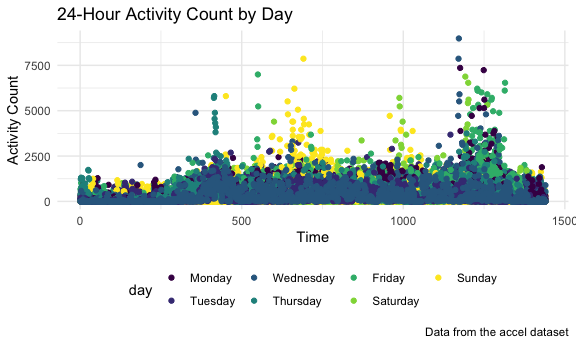

p8105_hw3_nr2774
================
Nergui
2022-10-09

### Problem 1

``` r
#devtools::install_github("p8105/p8105.datasets")
library(tidyverse)
```

    ## ── Attaching packages ─────────────────────────────────────── tidyverse 1.3.2 ──
    ## ✔ ggplot2 3.3.6      ✔ purrr   0.3.4 
    ## ✔ tibble  3.1.8      ✔ dplyr   1.0.10
    ## ✔ tidyr   1.2.1      ✔ stringr 1.4.1 
    ## ✔ readr   2.1.2      ✔ forcats 0.5.2 
    ## ── Conflicts ────────────────────────────────────────── tidyverse_conflicts() ──
    ## ✖ dplyr::filter() masks stats::filter()
    ## ✖ dplyr::lag()    masks stats::lag()

``` r
library(dplyr)
library(readxl)
library(ggplot2)
library(patchwork)
library(p8105.datasets)
library(lubridate)
```

    ## 
    ## Attaching package: 'lubridate'
    ## 
    ## The following objects are masked from 'package:base':
    ## 
    ##     date, intersect, setdiff, union

``` r
data("instacart")

knitr::opts_chunk$set(
  fig.width = 6,
  fig.asp = .6,
  out.width = "90%"
)

theme_set(theme_minimal() + theme(legend.position = "bottom"))

options(
  ggplot2.continuous.colour = "viridis",
  ggplot2.continuous.fill = "viridis"
)

scale_colour_discrete = scale_colour_viridis_d
scale_fill_discrete = scale_fill_viridis_d
```

### Problem 2

``` r
# Load, tidy, and otherwise wrangle the data.
#what the col_intger? 
accel_df = read_csv("data_hw3/accel_data.csv",
                    col_types = cols(
      week = col_integer(),
      day_id = col_integer()
      )) %>%
  janitor::clean_names() |> 
    mutate(
    weekend = case_when(
      day == "Monday" ~ "weekday",
      day == "Tuesday" ~ "weekday",
      day == "Wednesday" ~ "weekday",
      day == "Thursday" ~ "weekday",
      day == "Friday" ~ "weekday",
      day == "Saturday" ~ "weekend",
      day == "Sunday" ~ "weekend"
    ),
    day = fct_relevel(day,"Monday", "Tuesday", "Wednesday", "Thursday",
                      "Friday", "Saturday", "Sunday"))

accel_df_pivot = accel_df |> 
  relocate("weekend") %>%
  pivot_longer(
    activity_1:activity_1440, 
    names_to = "activity",
    names_prefix = "activity_",
    values_to = "activity_count") |> 
  rename(activity_min = activity) |> 
  mutate(activity_min = as.numeric(activity_min))
```

-   There are 35 observations in the activiy dataset along with 1444
    variables. Those variables are called week, day_id, day, activity_1,
    activity_2, activity_3, activity_4, activity_5, activity_6,
    activity_7, activity_8, activity_9, activity_10, activity_11,
    activity_12, activity_13, activity_14, activity_15, activity_16,
    activity_17, activity_18, activity_19, activity_20, activity_21,
    activity_22, activity_23, activity_24, activity_25, activity_26,
    activity_27, activity_28, activity_29, activity_30, activity_31,
    activity_32, activity_33, activity_34, activity_35, activity_36,
    activity_37, activity_38, activity_39, activity_40, activity_41,
    activity_42, activity_43, activity_44, activity_45, activity_46,
    activity_47, activity_48, activity_49, activity_50, activity_51,
    activity_52, activity_53, activity_54, activity_55, activity_56,
    activity_57, activity_58, activity_59, activity_60, activity_61,
    activity_62, activity_63, activity_64, activity_65, activity_66,
    activity_67, activity_68, activity_69, activity_70, activity_71,
    activity_72, activity_73, activity_74, activity_75, activity_76,
    activity_77, activity_78, activity_79, activity_80, activity_81,
    activity_82, activity_83, activity_84, activity_85, activity_86,
    activity_87, activity_88, activity_89, activity_90, activity_91,
    activity_92, activity_93, activity_94, activity_95, activity_96,
    activity_97, activity_98, activity_99, activity_100, activity_101,
    activity_102, activity_103, activity_104, activity_105,
    activity_106, activity_107, activity_108, activity_109,
    activity_110, activity_111, activity_112, activity_113,
    activity_114, activity_115, activity_116, activity_117,
    activity_118, activity_119, activity_120, activity_121,
    activity_122, activity_123, activity_124, activity_125,
    activity_126, activity_127, activity_128, activity_129,
    activity_130, activity_131, activity_132, activity_133,
    activity_134, activity_135, activity_136, activity_137,
    activity_138, activity_139, activity_140, activity_141,
    activity_142, activity_143, activity_144, activity_145,
    activity_146, activity_147, activity_148, activity_149,
    activity_150, activity_151, activity_152, activity_153,
    activity_154, activity_155, activity_156, activity_157,
    activity_158, activity_159, activity_160, activity_161,
    activity_162, activity_163, activity_164, activity_165,
    activity_166, activity_167, activity_168, activity_169,
    activity_170, activity_171, activity_172, activity_173,
    activity_174, activity_175, activity_176, activity_177,
    activity_178, activity_179, activity_180, activity_181,
    activity_182, activity_183, activity_184, activity_185,
    activity_186, activity_187, activity_188, activity_189,
    activity_190, activity_191, activity_192, activity_193,
    activity_194, activity_195, activity_196, activity_197,
    activity_198, activity_199, activity_200, activity_201,
    activity_202, activity_203, activity_204, activity_205,
    activity_206, activity_207, activity_208, activity_209,
    activity_210, activity_211, activity_212, activity_213,
    activity_214, activity_215, activity_216, activity_217,
    activity_218, activity_219, activity_220, activity_221,
    activity_222, activity_223, activity_224, activity_225,
    activity_226, activity_227, activity_228, activity_229,
    activity_230, activity_231, activity_232, activity_233,
    activity_234, activity_235, activity_236, activity_237,
    activity_238, activity_239, activity_240, activity_241,
    activity_242, activity_243, activity_244, activity_245,
    activity_246, activity_247, activity_248, activity_249,
    activity_250, activity_251, activity_252, activity_253,
    activity_254, activity_255, activity_256, activity_257,
    activity_258, activity_259, activity_260, activity_261,
    activity_262, activity_263, activity_264, activity_265,
    activity_266, activity_267, activity_268, activity_269,
    activity_270, activity_271, activity_272, activity_273,
    activity_274, activity_275, activity_276, activity_277,
    activity_278, activity_279, activity_280, activity_281,
    activity_282, activity_283, activity_284, activity_285,
    activity_286, activity_287, activity_288, activity_289,
    activity_290, activity_291, activity_292, activity_293,
    activity_294, activity_295, activity_296, activity_297,
    activity_298, activity_299, activity_300, activity_301,
    activity_302, activity_303, activity_304, activity_305,
    activity_306, activity_307, activity_308, activity_309,
    activity_310, activity_311, activity_312, activity_313,
    activity_314, activity_315, activity_316, activity_317,
    activity_318, activity_319, activity_320, activity_321,
    activity_322, activity_323, activity_324, activity_325,
    activity_326, activity_327, activity_328, activity_329,
    activity_330, activity_331, activity_332, activity_333,
    activity_334, activity_335, activity_336, activity_337,
    activity_338, activity_339, activity_340, activity_341,
    activity_342, activity_343, activity_344, activity_345,
    activity_346, activity_347, activity_348, activity_349,
    activity_350, activity_351, activity_352, activity_353,
    activity_354, activity_355, activity_356, activity_357,
    activity_358, activity_359, activity_360, activity_361,
    activity_362, activity_363, activity_364, activity_365,
    activity_366, activity_367, activity_368, activity_369,
    activity_370, activity_371, activity_372, activity_373,
    activity_374, activity_375, activity_376, activity_377,
    activity_378, activity_379, activity_380, activity_381,
    activity_382, activity_383, activity_384, activity_385,
    activity_386, activity_387, activity_388, activity_389,
    activity_390, activity_391, activity_392, activity_393,
    activity_394, activity_395, activity_396, activity_397,
    activity_398, activity_399, activity_400, activity_401,
    activity_402, activity_403, activity_404, activity_405,
    activity_406, activity_407, activity_408, activity_409,
    activity_410, activity_411, activity_412, activity_413,
    activity_414, activity_415, activity_416, activity_417,
    activity_418, activity_419, activity_420, activity_421,
    activity_422, activity_423, activity_424, activity_425,
    activity_426, activity_427, activity_428, activity_429,
    activity_430, activity_431, activity_432, activity_433,
    activity_434, activity_435, activity_436, activity_437,
    activity_438, activity_439, activity_440, activity_441,
    activity_442, activity_443, activity_444, activity_445,
    activity_446, activity_447, activity_448, activity_449,
    activity_450, activity_451, activity_452, activity_453,
    activity_454, activity_455, activity_456, activity_457,
    activity_458, activity_459, activity_460, activity_461,
    activity_462, activity_463, activity_464, activity_465,
    activity_466, activity_467, activity_468, activity_469,
    activity_470, activity_471, activity_472, activity_473,
    activity_474, activity_475, activity_476, activity_477,
    activity_478, activity_479, activity_480, activity_481,
    activity_482, activity_483, activity_484, activity_485,
    activity_486, activity_487, activity_488, activity_489,
    activity_490, activity_491, activity_492, activity_493,
    activity_494, activity_495, activity_496, activity_497,
    activity_498, activity_499, activity_500, activity_501,
    activity_502, activity_503, activity_504, activity_505,
    activity_506, activity_507, activity_508, activity_509,
    activity_510, activity_511, activity_512, activity_513,
    activity_514, activity_515, activity_516, activity_517,
    activity_518, activity_519, activity_520, activity_521,
    activity_522, activity_523, activity_524, activity_525,
    activity_526, activity_527, activity_528, activity_529,
    activity_530, activity_531, activity_532, activity_533,
    activity_534, activity_535, activity_536, activity_537,
    activity_538, activity_539, activity_540, activity_541,
    activity_542, activity_543, activity_544, activity_545,
    activity_546, activity_547, activity_548, activity_549,
    activity_550, activity_551, activity_552, activity_553,
    activity_554, activity_555, activity_556, activity_557,
    activity_558, activity_559, activity_560, activity_561,
    activity_562, activity_563, activity_564, activity_565,
    activity_566, activity_567, activity_568, activity_569,
    activity_570, activity_571, activity_572, activity_573,
    activity_574, activity_575, activity_576, activity_577,
    activity_578, activity_579, activity_580, activity_581,
    activity_582, activity_583, activity_584, activity_585,
    activity_586, activity_587, activity_588, activity_589,
    activity_590, activity_591, activity_592, activity_593,
    activity_594, activity_595, activity_596, activity_597,
    activity_598, activity_599, activity_600, activity_601,
    activity_602, activity_603, activity_604, activity_605,
    activity_606, activity_607, activity_608, activity_609,
    activity_610, activity_611, activity_612, activity_613,
    activity_614, activity_615, activity_616, activity_617,
    activity_618, activity_619, activity_620, activity_621,
    activity_622, activity_623, activity_624, activity_625,
    activity_626, activity_627, activity_628, activity_629,
    activity_630, activity_631, activity_632, activity_633,
    activity_634, activity_635, activity_636, activity_637,
    activity_638, activity_639, activity_640, activity_641,
    activity_642, activity_643, activity_644, activity_645,
    activity_646, activity_647, activity_648, activity_649,
    activity_650, activity_651, activity_652, activity_653,
    activity_654, activity_655, activity_656, activity_657,
    activity_658, activity_659, activity_660, activity_661,
    activity_662, activity_663, activity_664, activity_665,
    activity_666, activity_667, activity_668, activity_669,
    activity_670, activity_671, activity_672, activity_673,
    activity_674, activity_675, activity_676, activity_677,
    activity_678, activity_679, activity_680, activity_681,
    activity_682, activity_683, activity_684, activity_685,
    activity_686, activity_687, activity_688, activity_689,
    activity_690, activity_691, activity_692, activity_693,
    activity_694, activity_695, activity_696, activity_697,
    activity_698, activity_699, activity_700, activity_701,
    activity_702, activity_703, activity_704, activity_705,
    activity_706, activity_707, activity_708, activity_709,
    activity_710, activity_711, activity_712, activity_713,
    activity_714, activity_715, activity_716, activity_717,
    activity_718, activity_719, activity_720, activity_721,
    activity_722, activity_723, activity_724, activity_725,
    activity_726, activity_727, activity_728, activity_729,
    activity_730, activity_731, activity_732, activity_733,
    activity_734, activity_735, activity_736, activity_737,
    activity_738, activity_739, activity_740, activity_741,
    activity_742, activity_743, activity_744, activity_745,
    activity_746, activity_747, activity_748, activity_749,
    activity_750, activity_751, activity_752, activity_753,
    activity_754, activity_755, activity_756, activity_757,
    activity_758, activity_759, activity_760, activity_761,
    activity_762, activity_763, activity_764, activity_765,
    activity_766, activity_767, activity_768, activity_769,
    activity_770, activity_771, activity_772, activity_773,
    activity_774, activity_775, activity_776, activity_777,
    activity_778, activity_779, activity_780, activity_781,
    activity_782, activity_783, activity_784, activity_785,
    activity_786, activity_787, activity_788, activity_789,
    activity_790, activity_791, activity_792, activity_793,
    activity_794, activity_795, activity_796, activity_797,
    activity_798, activity_799, activity_800, activity_801,
    activity_802, activity_803, activity_804, activity_805,
    activity_806, activity_807, activity_808, activity_809,
    activity_810, activity_811, activity_812, activity_813,
    activity_814, activity_815, activity_816, activity_817,
    activity_818, activity_819, activity_820, activity_821,
    activity_822, activity_823, activity_824, activity_825,
    activity_826, activity_827, activity_828, activity_829,
    activity_830, activity_831, activity_832, activity_833,
    activity_834, activity_835, activity_836, activity_837,
    activity_838, activity_839, activity_840, activity_841,
    activity_842, activity_843, activity_844, activity_845,
    activity_846, activity_847, activity_848, activity_849,
    activity_850, activity_851, activity_852, activity_853,
    activity_854, activity_855, activity_856, activity_857,
    activity_858, activity_859, activity_860, activity_861,
    activity_862, activity_863, activity_864, activity_865,
    activity_866, activity_867, activity_868, activity_869,
    activity_870, activity_871, activity_872, activity_873,
    activity_874, activity_875, activity_876, activity_877,
    activity_878, activity_879, activity_880, activity_881,
    activity_882, activity_883, activity_884, activity_885,
    activity_886, activity_887, activity_888, activity_889,
    activity_890, activity_891, activity_892, activity_893,
    activity_894, activity_895, activity_896, activity_897,
    activity_898, activity_899, activity_900, activity_901,
    activity_902, activity_903, activity_904, activity_905,
    activity_906, activity_907, activity_908, activity_909,
    activity_910, activity_911, activity_912, activity_913,
    activity_914, activity_915, activity_916, activity_917,
    activity_918, activity_919, activity_920, activity_921,
    activity_922, activity_923, activity_924, activity_925,
    activity_926, activity_927, activity_928, activity_929,
    activity_930, activity_931, activity_932, activity_933,
    activity_934, activity_935, activity_936, activity_937,
    activity_938, activity_939, activity_940, activity_941,
    activity_942, activity_943, activity_944, activity_945,
    activity_946, activity_947, activity_948, activity_949,
    activity_950, activity_951, activity_952, activity_953,
    activity_954, activity_955, activity_956, activity_957,
    activity_958, activity_959, activity_960, activity_961,
    activity_962, activity_963, activity_964, activity_965,
    activity_966, activity_967, activity_968, activity_969,
    activity_970, activity_971, activity_972, activity_973,
    activity_974, activity_975, activity_976, activity_977,
    activity_978, activity_979, activity_980, activity_981,
    activity_982, activity_983, activity_984, activity_985,
    activity_986, activity_987, activity_988, activity_989,
    activity_990, activity_991, activity_992, activity_993,
    activity_994, activity_995, activity_996, activity_997,
    activity_998, activity_999, activity_1000, activity_1001,
    activity_1002, activity_1003, activity_1004, activity_1005,
    activity_1006, activity_1007, activity_1008, activity_1009,
    activity_1010, activity_1011, activity_1012, activity_1013,
    activity_1014, activity_1015, activity_1016, activity_1017,
    activity_1018, activity_1019, activity_1020, activity_1021,
    activity_1022, activity_1023, activity_1024, activity_1025,
    activity_1026, activity_1027, activity_1028, activity_1029,
    activity_1030, activity_1031, activity_1032, activity_1033,
    activity_1034, activity_1035, activity_1036, activity_1037,
    activity_1038, activity_1039, activity_1040, activity_1041,
    activity_1042, activity_1043, activity_1044, activity_1045,
    activity_1046, activity_1047, activity_1048, activity_1049,
    activity_1050, activity_1051, activity_1052, activity_1053,
    activity_1054, activity_1055, activity_1056, activity_1057,
    activity_1058, activity_1059, activity_1060, activity_1061,
    activity_1062, activity_1063, activity_1064, activity_1065,
    activity_1066, activity_1067, activity_1068, activity_1069,
    activity_1070, activity_1071, activity_1072, activity_1073,
    activity_1074, activity_1075, activity_1076, activity_1077,
    activity_1078, activity_1079, activity_1080, activity_1081,
    activity_1082, activity_1083, activity_1084, activity_1085,
    activity_1086, activity_1087, activity_1088, activity_1089,
    activity_1090, activity_1091, activity_1092, activity_1093,
    activity_1094, activity_1095, activity_1096, activity_1097,
    activity_1098, activity_1099, activity_1100, activity_1101,
    activity_1102, activity_1103, activity_1104, activity_1105,
    activity_1106, activity_1107, activity_1108, activity_1109,
    activity_1110, activity_1111, activity_1112, activity_1113,
    activity_1114, activity_1115, activity_1116, activity_1117,
    activity_1118, activity_1119, activity_1120, activity_1121,
    activity_1122, activity_1123, activity_1124, activity_1125,
    activity_1126, activity_1127, activity_1128, activity_1129,
    activity_1130, activity_1131, activity_1132, activity_1133,
    activity_1134, activity_1135, activity_1136, activity_1137,
    activity_1138, activity_1139, activity_1140, activity_1141,
    activity_1142, activity_1143, activity_1144, activity_1145,
    activity_1146, activity_1147, activity_1148, activity_1149,
    activity_1150, activity_1151, activity_1152, activity_1153,
    activity_1154, activity_1155, activity_1156, activity_1157,
    activity_1158, activity_1159, activity_1160, activity_1161,
    activity_1162, activity_1163, activity_1164, activity_1165,
    activity_1166, activity_1167, activity_1168, activity_1169,
    activity_1170, activity_1171, activity_1172, activity_1173,
    activity_1174, activity_1175, activity_1176, activity_1177,
    activity_1178, activity_1179, activity_1180, activity_1181,
    activity_1182, activity_1183, activity_1184, activity_1185,
    activity_1186, activity_1187, activity_1188, activity_1189,
    activity_1190, activity_1191, activity_1192, activity_1193,
    activity_1194, activity_1195, activity_1196, activity_1197,
    activity_1198, activity_1199, activity_1200, activity_1201,
    activity_1202, activity_1203, activity_1204, activity_1205,
    activity_1206, activity_1207, activity_1208, activity_1209,
    activity_1210, activity_1211, activity_1212, activity_1213,
    activity_1214, activity_1215, activity_1216, activity_1217,
    activity_1218, activity_1219, activity_1220, activity_1221,
    activity_1222, activity_1223, activity_1224, activity_1225,
    activity_1226, activity_1227, activity_1228, activity_1229,
    activity_1230, activity_1231, activity_1232, activity_1233,
    activity_1234, activity_1235, activity_1236, activity_1237,
    activity_1238, activity_1239, activity_1240, activity_1241,
    activity_1242, activity_1243, activity_1244, activity_1245,
    activity_1246, activity_1247, activity_1248, activity_1249,
    activity_1250, activity_1251, activity_1252, activity_1253,
    activity_1254, activity_1255, activity_1256, activity_1257,
    activity_1258, activity_1259, activity_1260, activity_1261,
    activity_1262, activity_1263, activity_1264, activity_1265,
    activity_1266, activity_1267, activity_1268, activity_1269,
    activity_1270, activity_1271, activity_1272, activity_1273,
    activity_1274, activity_1275, activity_1276, activity_1277,
    activity_1278, activity_1279, activity_1280, activity_1281,
    activity_1282, activity_1283, activity_1284, activity_1285,
    activity_1286, activity_1287, activity_1288, activity_1289,
    activity_1290, activity_1291, activity_1292, activity_1293,
    activity_1294, activity_1295, activity_1296, activity_1297,
    activity_1298, activity_1299, activity_1300, activity_1301,
    activity_1302, activity_1303, activity_1304, activity_1305,
    activity_1306, activity_1307, activity_1308, activity_1309,
    activity_1310, activity_1311, activity_1312, activity_1313,
    activity_1314, activity_1315, activity_1316, activity_1317,
    activity_1318, activity_1319, activity_1320, activity_1321,
    activity_1322, activity_1323, activity_1324, activity_1325,
    activity_1326, activity_1327, activity_1328, activity_1329,
    activity_1330, activity_1331, activity_1332, activity_1333,
    activity_1334, activity_1335, activity_1336, activity_1337,
    activity_1338, activity_1339, activity_1340, activity_1341,
    activity_1342, activity_1343, activity_1344, activity_1345,
    activity_1346, activity_1347, activity_1348, activity_1349,
    activity_1350, activity_1351, activity_1352, activity_1353,
    activity_1354, activity_1355, activity_1356, activity_1357,
    activity_1358, activity_1359, activity_1360, activity_1361,
    activity_1362, activity_1363, activity_1364, activity_1365,
    activity_1366, activity_1367, activity_1368, activity_1369,
    activity_1370, activity_1371, activity_1372, activity_1373,
    activity_1374, activity_1375, activity_1376, activity_1377,
    activity_1378, activity_1379, activity_1380, activity_1381,
    activity_1382, activity_1383, activity_1384, activity_1385,
    activity_1386, activity_1387, activity_1388, activity_1389,
    activity_1390, activity_1391, activity_1392, activity_1393,
    activity_1394, activity_1395, activity_1396, activity_1397,
    activity_1398, activity_1399, activity_1400, activity_1401,
    activity_1402, activity_1403, activity_1404, activity_1405,
    activity_1406, activity_1407, activity_1408, activity_1409,
    activity_1410, activity_1411, activity_1412, activity_1413,
    activity_1414, activity_1415, activity_1416, activity_1417,
    activity_1418, activity_1419, activity_1420, activity_1421,
    activity_1422, activity_1423, activity_1424, activity_1425,
    activity_1426, activity_1427, activity_1428, activity_1429,
    activity_1430, activity_1431, activity_1432, activity_1433,
    activity_1434, activity_1435, activity_1436, activity_1437,
    activity_1438, activity_1439, activity_1440, weekend.

``` r
# create a table
accel_df_pivot_min = 
  accel_df_pivot |> 
  group_by(day_id, day, week) |> 
  summarize(total_activity = sum(activity_count),
                        .groups = "drop") |> 
    ungroup()  


accel_df_pivot_min |> 
  select(-day_id) |>
  pivot_wider(
    names_from = "day",
    values_from = "total_activity")
```

    ## # A tibble: 5 × 8
    ##    week  Friday  Monday Saturday Sunday Thursday Tuesday Wednesday
    ##   <int>   <dbl>   <dbl>    <dbl>  <dbl>    <dbl>   <dbl>     <dbl>
    ## 1     1 480543.  78828.   376254 631105  355924. 307094.   340115.
    ## 2     2 568839  295431    607175 422018  474048  423245    440962 
    ## 3     3 467420  685910    382928 467052  371230  381507    468869 
    ## 4     4 154049  409450      1440 260617  340291  319568    434460 
    ## 5     5 620860  389080      1440 138421  549658  367824    445366

-   Activity counts were lowest on the Saturdays of (weeks 4 and 5). The
    individual appears to be most active(gradualing increasing activity
    count) on weeks days.

``` r
## ??? this is not reading ? how to solve df problem? 
accel_df_pivot |> 
  ggplot(aes(x = activity_min, y = activity_count, color = day)) + geom_line() + 
  labs(
    title = "24-Hour Activity Count by Day",
    x = "Time",
    y = "Activity Count",
    caption = "Data from the accel dataset")
```


### Problem3

``` r
#??? hwo do you know units of the variables???

library(p8105.datasets)
data("ny_noaa")
```

The NY_NOAA dataset was driven from NOAA National Climatic Data Center.
It contains information from all New York state weather stations from
January 1, 1981 through December 31, 2010. The NOAA dataset contains
2595176 rows and 7 columns.

The variables in the data set are:

-   `id`: Weather station ID
-   `date`: Date of observation
-   `prcp`: Precipitation (tenths of mm)
-   `snow`: Snowfall (mm)
-   `snwd`: Snow depth (mm)
-   `tmax`: Maximum temperature (tenths of degrees C)
-   `tmin`: Minimum temperature (tenths of degrees C)

There are 747 distinct weather stations in NYS.

Because not all weather stations in NY collect all these variables, the
original dataset contains extensive amount of missing data.

To take a closer look at the amount of missing data, let’s look at what
proportion of data is missing for each variable.

``` r
noaa_missing = ny_noaa |> 
  summarize(
    missing_prcp = mean(is.na(prcp)),
    missing_snow = mean(is.na(snow)),
    missing_snwd = mean(is.na(snwd)),
    missing_tmax = mean(is.na(tmax)),
    missing_tmin = mean(is.na(tmin))
  ) |> 
  knitr::kable()
```

-   Data shows that there nearly 50% of data is missing in `tmax` and
    `tmin`. 43 % for each of these variables have missing data.

``` r
noaa_tidy = ny_noaa %>% 
  janitor::clean_names() %>% 
  separate(date, into = c("year", "month", "day"), convert = TRUE) %>%
  mutate(
    prcp = prcp / 10 ,
    tmax = as.numeric(tmax) / 10,
    tmin = as.numeric(tmin) / 10,
    year = as.numeric(year),
    day = as.numeric(day), 
    month = recode_factor(month,
          "01" = "January",
          "02" = "February",
          "03" = "March",
          "04" = "April",
          "05" = "May",
          "06" = "June",
          "07" = "July",
          "08" = "August",
          "09" = "September",
          "10" = "October",
          "11" = "November",
          "12" = "December"
          )) %>% 
  relocate(year, month, day, everything())
```

``` r
noaa_tidy |>  
  count(snow) |> 
  arrange(desc(n))
```

    ## # A tibble: 282 × 2
    ##     snow       n
    ##    <int>   <int>
    ##  1     0 2008508
    ##  2    NA  381221
    ##  3    25   31022
    ##  4    13   23095
    ##  5    51   18274
    ##  6    76   10173
    ##  7     8    9962
    ##  8     5    9748
    ##  9    38    9197
    ## 10     3    8790
    ## # … with 272 more rows

-   For snowfall, the most commonly observed value is ‘0’, indicating
    that the most days in NY is not snowy.

``` r
tmax_noaa = noaa_tidy %>% 
  filter(month %in% c("January", "July")) %>% 
  group_by(id, year, month) %>% 
  summarize(mean_tmax = mean(tmax, na.rm = TRUE))
```

    ## `summarise()` has grouped output by 'id', 'year'. You can override using the
    ## `.groups` argument.

``` r
ggplot(tmax_noaa, aes(x = year, y = mean_tmax, color = month)) +
  geom_point(alpha = 0.2) +
  geom_smooth(alpha = 0.5) +
  labs(
    title = "Avg Max Temp in January and July in each NY Station Across Years",
    x = "Year",
    y = "Temp (°C)",
    caption = "Data from the NOAA dataset"
  ) +
  scale_x_continuous(
    breaks = c(1980, 1985, 1990, 1995, 2000, 2005, 2010)
    ) +
  facet_grid(. ~ month) +
  scale_color_manual(values = c("navy", "orange")) +
  theme(
    legend.position = "none")
```

    ## `geom_smooth()` using method = 'gam' and formula 'y ~ s(x, bs = "cs")'

    ## Warning: Removed 5970 rows containing non-finite values (stat_smooth).

    ## Warning: Removed 5970 rows containing missing values (geom_point).


